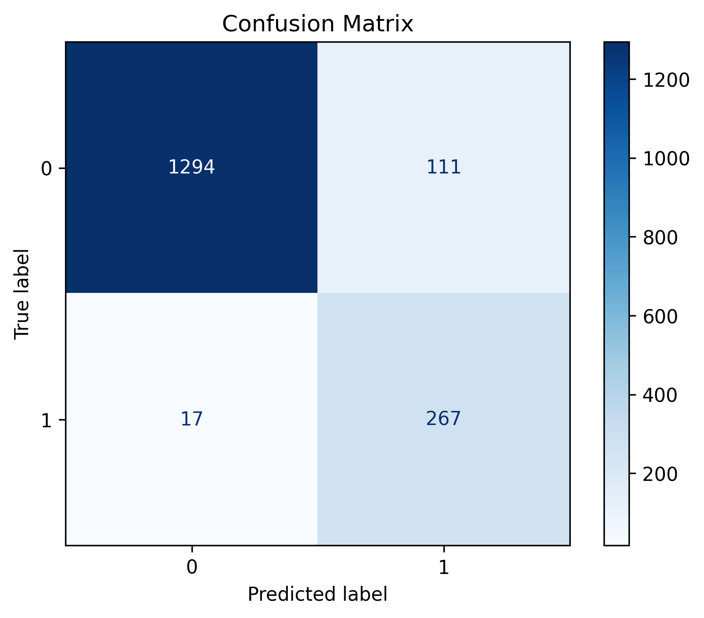
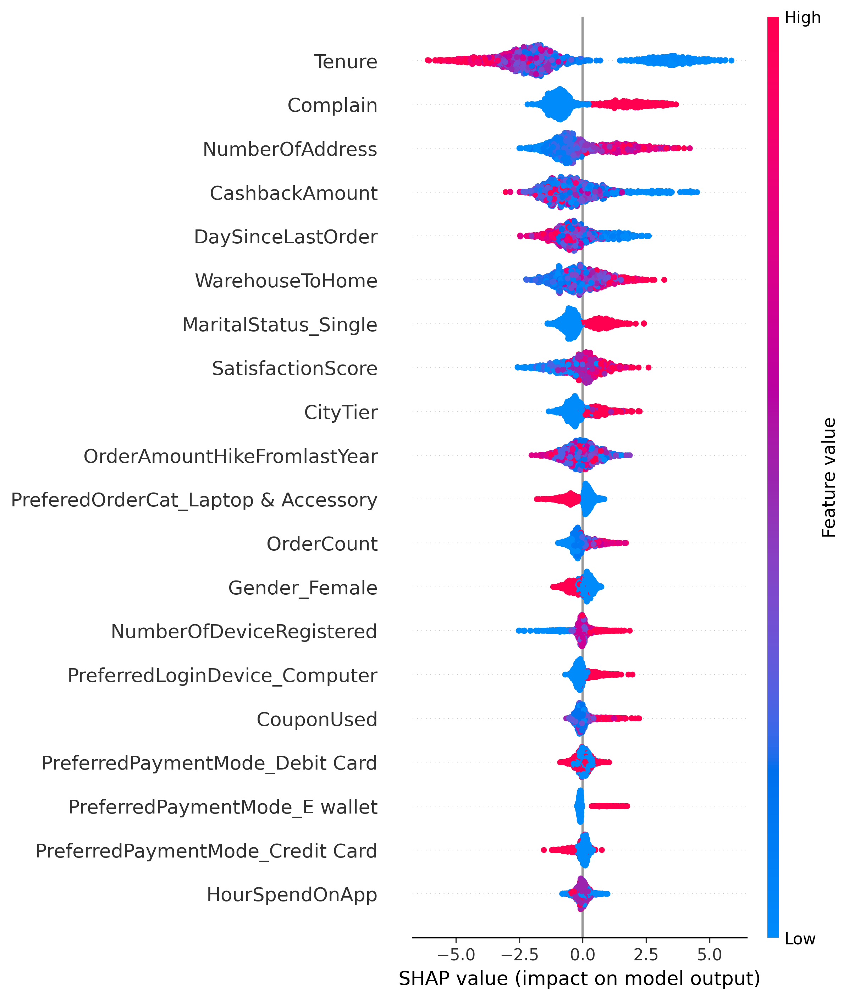
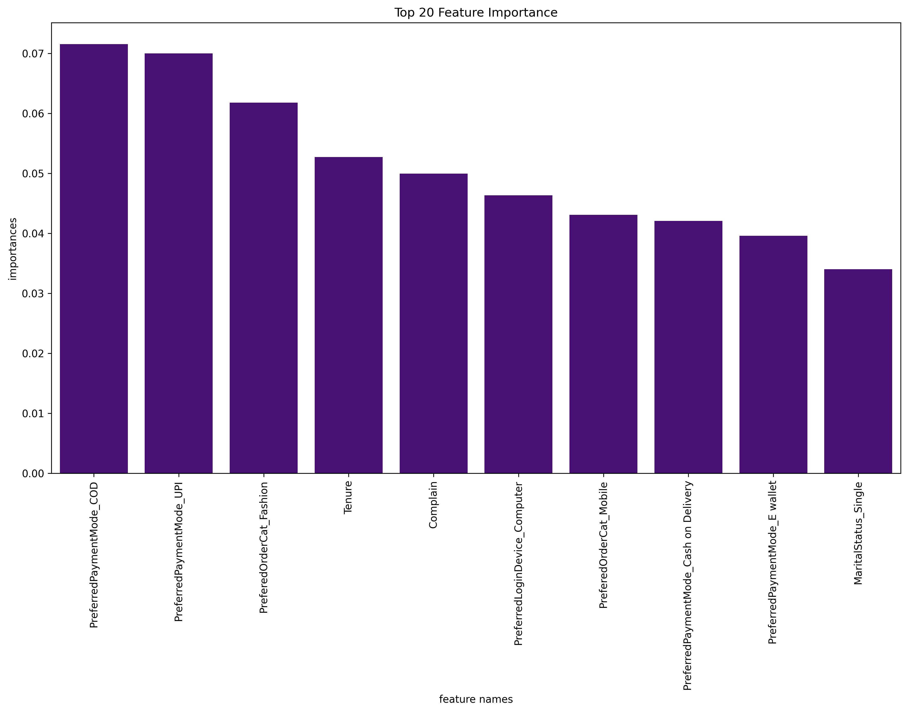

$M$ $&$ $V$ $—$ $Customer$ $Churn$ $Prediction$

Keeping customers > growing customers

`Executive summary (for non-technical readers)`

M & V is a multi-national retailer (fashion, electronics, computer accessories and more) founded in 2002, with ~2,500 employees and >1,000,000 customers worldwide. Over the past two decades the company grew from a small startup to a global brand — but growth brings a hidden cost: customer churn (lost customers) reduces lifetime value and amplifies acquisition spend.

This project builds a customer churn early-warning model. We trained four models (Logistic Regression, Decision Tree, Random Forest, XGBoost) and selected XGBoost as the production model. Because the business cost of losing a customer is high, we tuned the model to favor recall (finding true churners), setting a decision threshold of 0.20 which yields ≈94% recall. In plain terms: the model catches 94 out of 100 customers who will likely churn — we accept more false alarms to avoid losing valuable customers.

***Key business signals driving churn (from SHAP explainability)***:

Low tenure (newer customers are most likely to churn)

High number of complaints

Single / unmarried customers show higher churn risk in our data

Actionable result: deploy targeted retention campaigns (welcome/onboarding for new customers, fast complaint resolution, loyalty benefits) to reduce churn and protect profits.

**Profits (2002 → 2025) — USD millions**

Yearly net profits in USD millions — trend shows early growth, a dip during 2008–2009 (global shock) and 2020 (pandemic), then strong recovery and scale thereafter.

|Year |	Profit (USD millions)|
------|--------| ----------|
|2002|	1.2|
|2004|	3.5|
|2005|	5.0|
|2006|	7.5|
|2007|	10.0|
|2008|	9.0|
|2009|	8.5|
|2010|	12.0|
|2011|	15.0|
|2012|	20.0|
|2013|	24.0|
|2014|	30.0|
|2015|	36.0|
|016|	45.0|
|2018|	68.0|
|2019|	80.0|
|2020|	70.0|
|2021|	95.0|
|2022|	120.0|
|2023|	150.0|
|2024|	180.0|
|2025|	210.0|

***Mission & Vision***

Mission: "*To delight customers worldwide with thoughtfully designed products, exceptional value, and frictionless service — building long-term relationships through trust and convenience.
*"
Vision: "*To be the most customer-centric global lifestyle brand that transforms everyday shopping into an experience people love and rely on.*"

Company mantra for growth:

"*Keeping old customers is more important than efforts in getting new ones.*"

*********Problem statement*********

Customer churn erodes revenue and increases acquisition pressure. We want:

A model that identifies customers at high risk of leaving so M & V can intervene early.

Interpretable signals so business teams can design targeted retention programs.

A deployment plan that balances catching true churners with operational cost of interventions.

***Methodology***

Data cleaning — fill/flag missing values, deduplicate, correct datatypes.

Feature engineering — tenure.

Encoding & scaling — one-hot for categories (for SHAP interpretability).

Modeling — Logistic Regression, Decision Tree, Random Forest, XGBoost. Hyperparameter tuning with cross-validation (GridSearch / randomized search).

Evaluation — primary metric: recall (because false negatives are expensive). Secondary metrics: precision, F1, ROC-AUC.

Interpretation — SHAP for local/global explanations and feature effects.

Thresholding — calibrated predicted probabilities; final business threshold set to 0.20 to prioritize recall.

***Threshold choice & business reasoning***

Default 0.5 threshold optimizes for balanced errors; but M & V's business case treats false negatives (missed churners) as much more costly than false positives (unnecessary retention outreach).

We chose threshold = 0.20 because:

At 0.20 the model attains ~94% recall → catches most likely churners.

Precision decreases (more false alarms), but operational retention initiatives (e.g., email + small incentive) have a lower cost than losing customers.

Recommended: periodically re-evaluate threshold with live A/B tests measuring cost per retained customer.

***SHAP explainability — what the model is telling us***

(Short primer for non-tech readers: SHAP shows which features push a prediction toward churn or retention for any customer. Red = high feature value, blue = low. Right = pushes toward churn, left = pushes toward stay.)

Top signals that push customers toward churn:

Low tenure — customers with short relationship length are far more likely to leave. Early months are critical.

High number of complaints — unresolved or repeated complaints are a major churn driver.

Single / unmarried status — single customers in our sample show higher churn (could be linked to lifestyle/shopper behavior).

Low purchase frequency / long recency — customers who haven't bought in a while or buy infrequently have higher risk.

Low loyalty tier / no loyalty benefits — absence of loyalty perks increases churn probability.

*Top signals that push customers toward retention:*

Long tenure, high loyalty tier, consistent purchase frequency, high average order value.

***Business insights***

- Prioritize onboarding & early engagement

- Onboarding journeys for customers in months 0–6 reduce early churn. Use personalized offers, product education, and curated recommendations.

- Complaint triage and Service level agreements (SLA)

- Create a fast-track lane for customers with >1 complaint in 90 days.

- Loyalty & tenure incentives

- Introduce small, time-based perks (e.g., free shipping within first 3 months, early-access sales for 3–12 month milestones) to lock in new customers.

- Targeted outreach for flagged customers

- Use the model to power a Retention Playbook: email + discount + dedicated customer servce call depending on risk score and value.

- Run experiments to measure lift: compare retention among treated vs control high-risk groups (ROI-driven selection).

- Because single customers are at higher risk, create life-stage campaigns (gift bundles, social proof messaging) tailored to them.

- Monitor channels & cohorts

- If a particular acquisition channel produces high churn cohorts, adjust marketing spend or change onboarding.

***Personal insights***

- Models are only as valuable as the actions they enable: a 94% recall model is powerful only if Customer Experience and Marketing teams can operationalize timely interventions.

- Explainability (SHAP) turned model outputs into a conversation starter with product and ops teams — that’s where impact happens.

- Small, well-timed incentives for high-risk but high-value customers can yield large ROI; don't aim to treat every flagged customer the same.

***Recommendations***

- Deploy XGBoost model to score customers daily and route high-risk customers into the retention playbook.

- Start a 3-month pilot: treat top 10% highest-risk customers with a tiered intervention; measure churn lift and CAC savings.

- Improve complaint resolution: reduce average complaint closure time and run NPS surveys after resolution.

- Enhance onboarding for months 0–6: product guides, welcome offers, and personalization.

- Instrument monitoring: model performance dashboards (recall, precision, AUC), population drift and intervention A/B tests.
